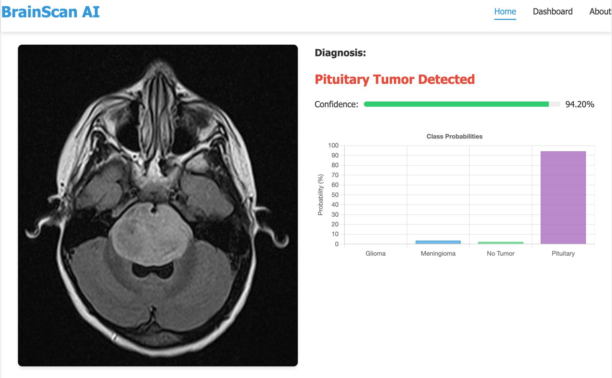
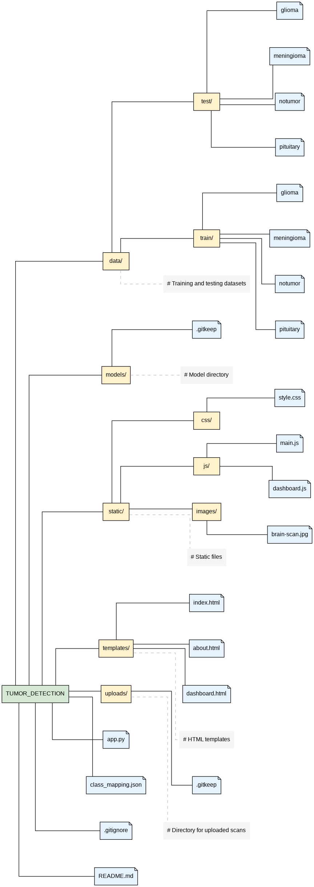
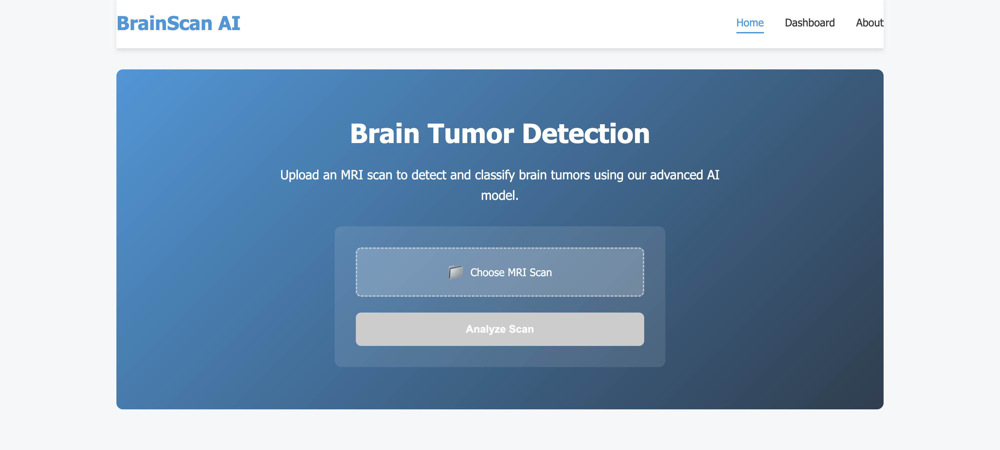
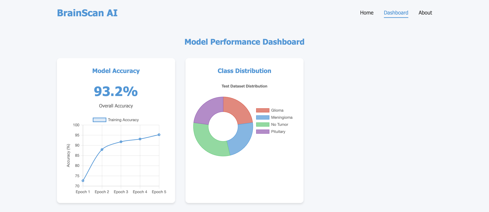
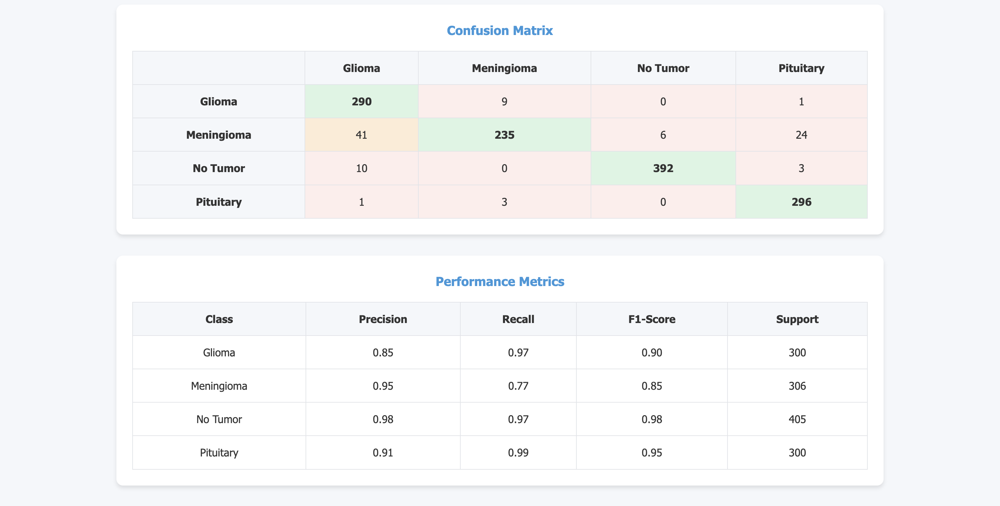
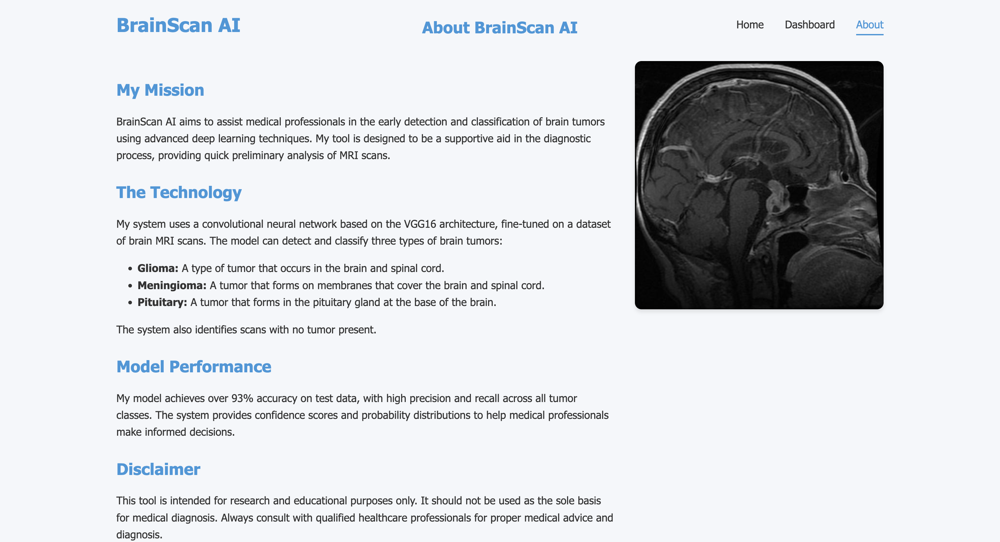

# Brain Tumor Detection Web Application

This is a Flask-based web application for detecting and classifying brain tumors from MRI scans using a deep learning model.

## Machine Learning Approach

### Model Architecture

Here I am trying to solve the multi class (4 classes) classification problem in the domain of computer vision by trainning VGG16.

## Analyzed O/P

Analyzed Image with the confidence score as per the classes

  

## Project Structure

  

The diagram above illustrates the organization of the Brain Tumor Detection application.

## User Interface

### Home Page

  

The application features a clean, user-friendly interface for uploading and analyzing MRI scans.

### Key Features

  

My application offers three key capabilities:
- **Advanced AI Model**: Powered by a deep learning model trained on thousands of MRI scans
- **Multi-Class Detection**: Detects multiple tumor types: Glioma, Meningioma, and Pituitary
- **Detailed Analysis**: Provides confidence scores and probability distribution for each class

## Model Performance

### Dashboard Overview

  

The model achieves 93.2% overall accuracy on the test dataset, with performance improving consistently across training epochs.

### Detailed Evaluation

  

The confusion matrix and performance metrics show strong results across all tumor classes:
- **Glioma**: Precision 0.85, Recall 0.97, F1-Score 0.90
- **Meningioma**: Precision 0.95, Recall 0.77, F1-Score 0.85
- **No Tumor**: Precision 0.98, Recall 0.97, F1-Score 0.98
- **Pituitary**: Precision 0.91, Recall 0.99, F1-Score 0.95

## About the Project

  

### My Mission

BrainScan AI aims to assist medical professionals in the early detection and classification of brain tumors using advanced deep learning techniques. Our tool is designed to be a supportive aid in the diagnostic process, providing quick preliminary analysis of MRI scans.

### The Technology

My system uses a convolutional neural network based on the VGG16 architecture, fine-tuned on a dataset of brain MRI scans. The model can detect and classify three types of brain tumors:
- **Glioma**: A type of tumor that occurs in the brain and spinal cord.
- **Meningioma**: A tumor that forms on membranes that cover the brain and spinal cord.
- **Pituitary**: A tumor that forms in the pituitary gland at the base of the brain.

The system also identifies scans with no tumor present.

## Features

- Upload and analyze MRI scans
- Detect and classify brain tumors (Glioma, Meningioma, Pituitary)
- Display confidence scores and probability distribution
- Responsive design for all devices
- Dashboard with model performance metrics

